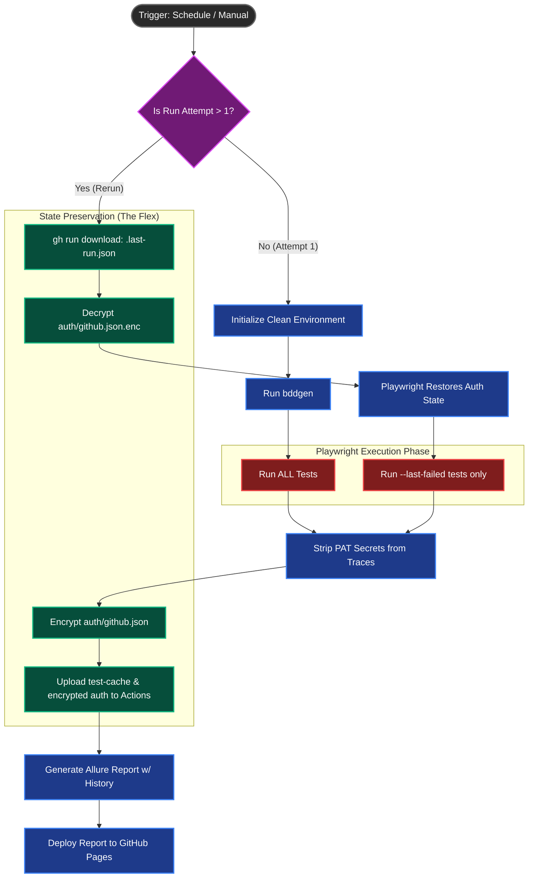

# Playwright E2E CI/CD Visualization

Here is the exact logical flow of your advanced `.github/workflows/e2e-full.yml` pipeline. This visualization makes it extremely easy to understand the `--last-failed` caching and Auth State encryption.

## The Pipeline Flow (Mermaid Diagram)

### How to use this:

You can take a screenshot of this Mermaid diagram (or copy the code into a Mermaid live editor) and include it in your blog post or LinkedIn carousel to visually prove your architectural claims!
