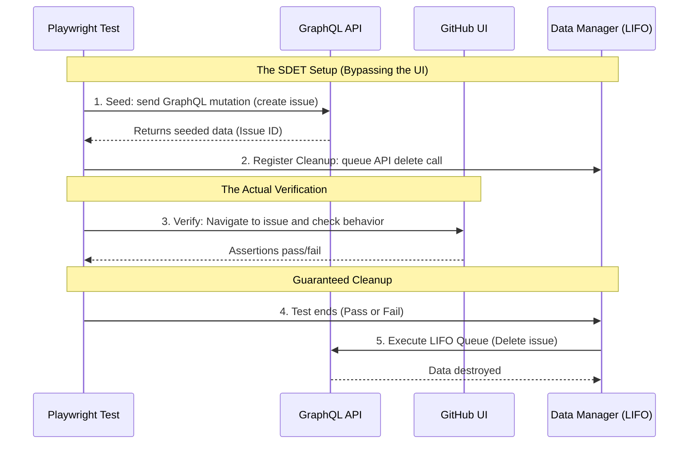
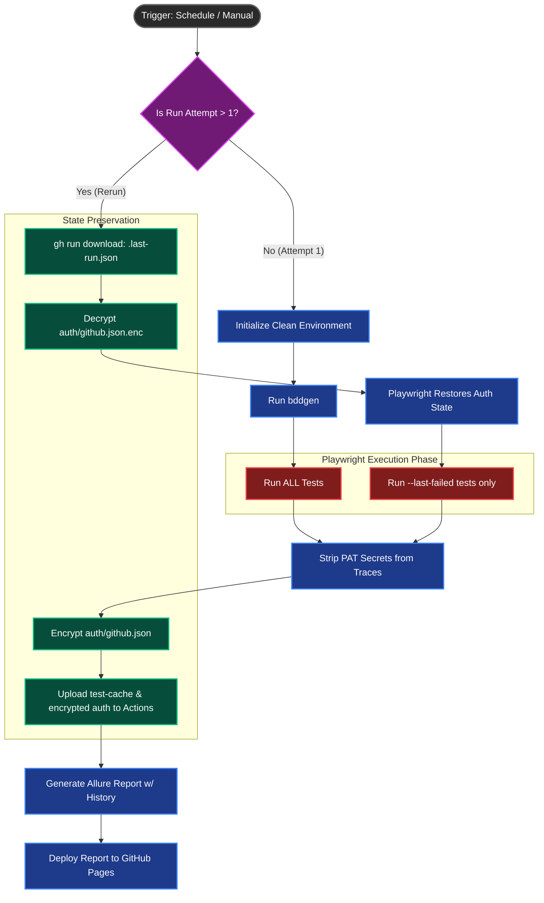

# Playwright Framework Visualizations

Here are three Mermaid diagrams that perfectly visualize the core concepts discussed in `12-from-manual-to-framework.md`. You can screenshot these and embed them directly into the blog post or your LinkedIn carousel to make the dense technical concepts easy to understand at a glance.

---

## 1. The Bridge: Behavior vs. Implementation (BDD Architecture)

This diagram visualizes how the framework separates "what we test" from "how we test it", avoiding the trap of coupling test logic directly to the DOM.

```mermaid
flowchart LR
    %% Styles
    classDef manual fill:#f59e0b,stroke:#b45309,stroke-width:2px,color:#fff
    classDef behavior fill:#10b981,stroke:#047857,stroke-width:2px,color:#fff
    classDef step fill:#3b82f6,stroke:#1d4ed8,stroke-width:2px,color:#fff
    classDef pom fill:#8b5cf6,stroke:#6d28d9,stroke-width:2px,color:#fff
    classDef browser fill:#1f2937,stroke:#111827,stroke-width:2px,color:#fff

    subgraph "The Problem Definition"
        Manual[Manual Test Case\n'Verify user can update issue']:::manual
    end

    subgraph "The Behavior (What)"
        Gherkin[Gherkin Feature File\n'When I update the issue description...']:::behavior
    end

    subgraph "The Implementation (How)"
        StepDef[Step Definition\n'issuePage.updateDescription()']:::step
        POM[Page Object Model\n'page.getByRole(...)']:::pom
    end

    Browser((Browser DOM)):::browser

    Manual -- Translated to --> Gherkin
    Gherkin -- Mapped to --> StepDef
    StepDef -- Calls --> POM
    POM -- Interacts with --> Browser
```

---

## 2. The SDET Flex: Data Lifecycle & Test Isolation

This diagram contrasts the "junior" way of setting up tests (clicking through the UI) versus the "SDET" way (bypassing the UI with GraphQL and ensuring automatic cleanup).



---

## 3. The CI/CD Flex: Re-run Failed Only & Auth Caching

This diagram shows the logic of `.github/workflows/e2e-full.yml`, specifically how it handles test failures and authentication intelligently on a rerun.


